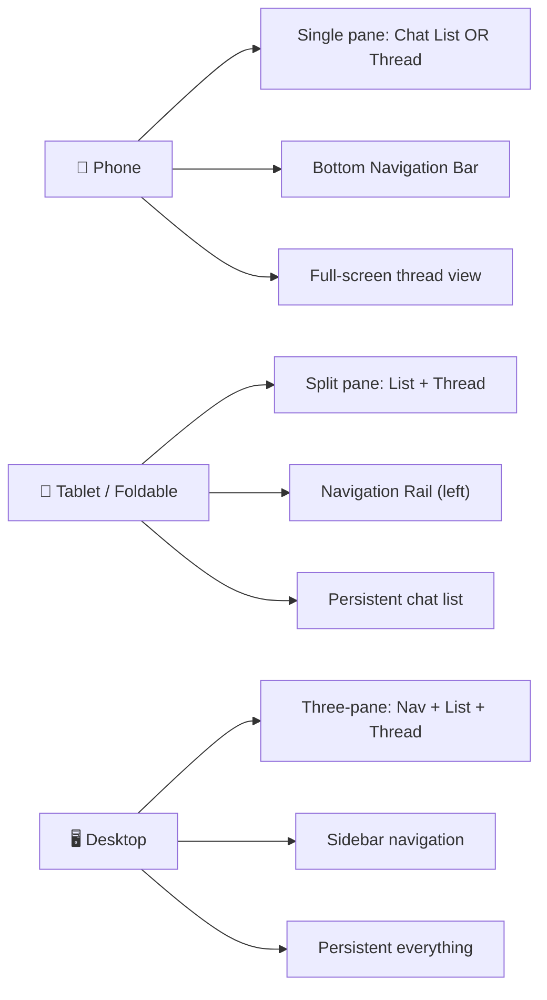
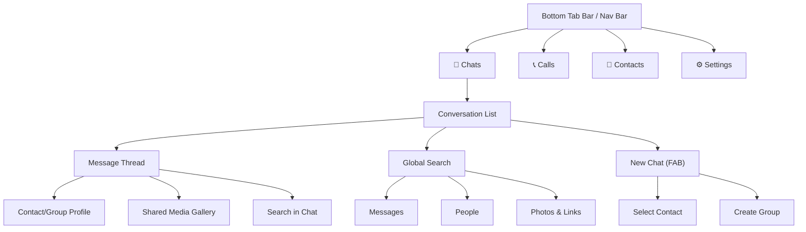
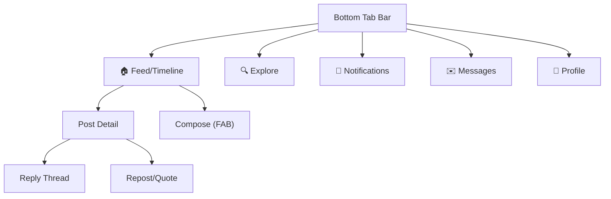

# 💬 Chat & Messaging App — Complete UI/UX Design Guide

> Compiled from deep research across **Refactoring UI**, **Material Design 3**, and **Apple Human Interface Guidelines**

---

## Table of Contents
1. [Design Philosophy & Personality](#1-design-philosophy--personality)
2. [Visual Hierarchy](#2-visual-hierarchy)
3. [Color System](#3-color-system)
4. [Typography](#4-typography)
5. [Layout & Spacing](#5-layout--spacing)
6. [Core Screens & Navigation](#6-core-screens--navigation)
7. [Components Catalog](#7-components-catalog)
8. [Motion & Animation](#8-motion--animation)
9. [Depth, Elevation & Materials](#9-depth-elevation--materials)
10. [Images, Media & User Content](#10-images-media--user-content)
11. [Dark Mode](#11-dark-mode)
12. [Accessibility](#12-accessibility)
13. [Notifications & System Integration](#13-notifications--system-integration)
14. [Finishing Touches](#14-finishing-touches)
15. [Cross-Reference Matrix](#15-cross-reference-matrix)

---

## 1. Design Philosophy & Personality

### Refactoring UI — "Design with tactics, not talent"
- **Start with the feature, not the layout** — Design the core: the **individual message thread** (a single text bubble, the compose bar). Get that right before designing the chat list or settings shell.
- **Choose a personality** — Playful (Snapchat): fully rounded bubbles, bright colors. Professional (Slack): smaller radii, muted palette. Dark & sleek (Telegram): rich tints, subtle gradients.
- **Don't design too much** — Focus on sending/receiving a message for MVP. Skip animated stickers, stories, and voice rooms until later.
- **Detail comes later** — Block out bubbles and input area as simple rectangles in grayscale before deciding if sent bubbles should be blue or green.
- **Limit your choices** — 1-2 fonts, fixed spacing scale (4/8/16px), and a strict color palette from day one.

### Material Design 3 — "Personal, adaptive, expressive"
- **Dynamic Color** — Leverage M3's wallpaper-based dynamic color to personalize the app. Every user's messaging experience feels uniquely theirs.
- **Component-rich** — M3 provides purpose-built components for every chat pattern: lists, text fields, FABs, badges, chips, bottom sheets, dialogs, snackbars.
- **Responsive** — Phone → tablet → foldable → desktop, with canonical split-pane layouts.

### Apple HIG — "Clarity, Deference, Depth"
- **Clarity** — The conversation is the core content. Timestamps and read receipts should be distinct but subtle. Minimize visual noise.
- **Deference** — UI should recede to elevate the conversation. Clean edge-to-edge layouts, no heavy opaque containers.
- **Depth** — Visual layers convey hierarchy. Context menus for reactions layer over chat with blur. Message bubbles feel distinct from the background.

> [!TIP]
> **Convergence point:** All three sources agree — the **conversation content** is the hero. Every UI element exists to serve the message, not compete with it.

---

## 2. Visual Hierarchy

### Hierarchy Tactics for Chat Apps

| Principle | Source | Chat App Application |
|---|---|---|
| **Not all elements are equal** | Refactoring UI | Chat list: sender name + preview = primary. Timestamp + mute icon = secondary |
| **Size isn't everything** | Refactoring UI | Don't shrink timestamps to microscopic size. Keep readable but use lighter grey |
| **Don't use grey on colored backgrounds** | Refactoring UI | Blue sent bubble → timestamps inside use semi-transparent white, not grey |
| **De-emphasize to emphasize** | Refactoring UI | Make compose area stand out: give chat background subtle off-white tint, keep input field pure white |
| **Labels are a last resort** | Refactoring UI | Profile screen: don't write "Phone: 555-1234". Just icon + number |
| **Balance weight & contrast** | Refactoring UI | Contact list: bold for name (high weight), regular lighter grey for status (lower contrast) |

### Chat List Hierarchy

```
┌──────────────────────────────────────────────────────┐
│  ┌──┐                                                │
│  │AV│  Sender Name (bold, dark)          9:41 AM     │
│  │AT│  Last message preview text... (regular, grey)   │
│  │AR│                                    🔵 unread   │
│  └──┘                                                │
├──────────────────────────────────────────────────────┤
│  Primary: Name + Preview                             │
│  Secondary: Timestamp + Badge                        │
│  Tertiary: Mute/Pin indicators                       │
└──────────────────────────────────────────────────────┘
```

### M3 Typography Mapping for Hierarchy

| Element | M3 Role | Weight | Color |
|---|---|---|---|
| Sender name (unread) | Title Medium | Bold | On Surface |
| Sender name (read) | Body Medium | Regular | On Surface |
| Message preview (unread) | Body Medium | Medium | On Surface |
| Message preview (read) | Body Medium | Regular | On Surface Variant |
| Timestamp | Label Small | Regular | On Surface Variant |
| Unread badge | Label Small | Bold | On Primary (inside Primary badge) |

---

## 3. Color System

### Message Bubble Colors

```
SENT MESSAGES (right-aligned)
┌──────────────────────────────────────────┐
│  M3: Primary Container / On Primary Container │
│  HIG: System Blue or Green tint              │
│  Dark Mode: Slightly muted tint             │
└──────────────────────────────────────────┘

RECEIVED MESSAGES (left-aligned)
┌──────────────────────────────────────────┐
│  M3: Surface Variant / On Surface Variant    │
│  HIG: System Gray or elevated background     │
│  Dark Mode: Elevated grey (#2C2C2E)         │
└──────────────────────────────────────────┘
```

### Refactoring UI Color Tactics

- **Ditch hex for HSL** — Creates tap/hover highlights easily: drop Lightness by 5% when a chat is pressed.
- **You need more colors than you think** — "Blue" theme needs: light blue (backgrounds), vivid blue (send button), dark blue (text on colored surfaces).
- **Define shades up front** — 10-shade scale for greys and brand colors. Prevents inconsistency across borders, icons, and text.
- **Greys don't have to be grey** — Cool greys (blue-tinted) for dark mode feel modern and less harsh than pure neutral grey.
- **Don't rely on color alone** — Read receipts: don't just change checkmark color. Change the **icon itself** (one check = sent, two checks = delivered, filled checks = read).

### M3 Color Roles

| Role | Chat App Usage |
|---|---|
| **Primary** | Send button, unread badges, active tab indicator |
| **Primary Container** | Sent message bubble background |
| **Secondary** | Attachment icons, secondary actions |
| **Tertiary** | Special tags, premium badges |
| **Surface Variant** | Received message bubble background |
| **Error** | Failed message indicator, destructive actions |
| **On Surface Variant** | Timestamps, metadata, secondary text |

### Apple HIG Colors

- **Tint Color** — Singular accent for interactivity: Send button, back buttons, unread badges. Never color non-interactive elements.
- **Adaptive System Colors** — `systemBackground`, `secondarySystemBackground` for automatic Light/Dark transitions.
- **Bubble Distinction** — Right-aligned (user) = primary accent. Left-aligned (incoming) = neutral grey/white.

> [!IMPORTANT]
> **Accessible contrast** — White text inside a colored sent bubble must pass WCAG standards (4.5:1 ratio minimum). Test in both Light and Dark modes.

---

## 4. Typography

### Type Scale for Messaging

| Role | Size | Weight | Usage |
|---|---|---|---|
| **Section Header** | 20-22px | Bold | "Chats", "Contacts", "Settings" |
| **Chat List Name** | 16-17px | Semibold/Bold (unread) or Regular (read) | Contact/group name in conversation list |
| **Message Body** | 15-16px | Regular | Actual message text inside bubbles |
| **Preview Text** | 14-15px | Regular | Last message preview in chat list |
| **Sender Name (Group)** | 13-14px | Semibold | Sender identification in group chats |
| **Timestamp** | 11-12px | Regular | Time/date on messages and chat list |
| **Status/Metadata** | 10-11px | Regular | "typing...", "online", read receipts |
| **Date Divider** | 12-13px | Medium | "Today", "Yesterday", "Aug 31, 2026" |

### Key Typography Rules

| Rule | Application |
|---|---|
| **Use good fonts** | Chat = heavy reading. Use highly legible sans-serif: Inter, Roboto, SF Pro |
| **Keep line length in check** | Message bubbles cap at 60-70% of screen width (~45-75 chars per line) |
| **Avatar alignment** | Align avatar with the **top** (first line) of a multi-line bubble, not vertical center |
| **Line height is proportional** | Body text in messages: relaxed (1.5). Date dividers: tight (1.2) |
| **Text alignment** | Received = left-aligned. Sent = right-aligned. But text *inside* sent bubbles is still left-aligned |
| **Letter spacing for caps** | "TYPING..." indicator, date dividers: add letter-spacing for legibility |
| **Dynamic Type (HIG)** | Chat bubbles, input fields, and lists must scale with user's accessibility settings |
| **Not every link needs a color** | Message previews in chat list are obviously tappable — no blue/underline needed |

---

## 5. Layout & Spacing

### Spacing System

```
4px   — Tight: between consecutive bubbles from same sender
8px   — Internal bubble padding (horizontal)
10px  — Internal bubble padding (vertical)
12px  — Between avatar and bubble, between icon and label
16px  — Screen margins, chat list item padding
24px  — Between message groups from different senders
32px  — Section gaps
48px  — Large section separations
```

### Key Layout Rules

| Rule | Source | Application |
|---|---|---|
| **Start with too much white space** | Refactoring UI | Generous padding inside bubbles and between sender groups prevents clutter |
| **Max bubble width** | Refactoring UI | 60-70% of screen width. Never full width. |
| **Avoid ambiguous spacing** | Refactoring UI | Timestamp sits closer to its message than to the next message. Reply icons belong to the tweet above. |
| **Safe areas** | Apple HIG | Compose bar anchors above Home indicator without overlapping |
| **Keyboard avoidance** | Both M3 + HIG | Compose bar docks to keyboard. Use `UIKeyboardLayoutGuide` (iOS) or proper `WindowInsets` (Android) |
| **Min touch target** | Both M3 + HIG | 44×44pt (HIG) / 48×48dp (M3) for all interactive elements |

### Responsive Layouts



### Message Bubble Layout

```
RECEIVED (left-aligned):                    SENT (right-aligned):
┌─────────────────────────┐                        ┌─────────────────────────┐
│ Sender Name (group only)│                        │                         │
│                         │                        │  Hey! How's it going?   │
│  Hello! I was thinking  │                        │  Want to grab lunch?    │
│  about the project...   │                        │                         │
│                         │                        │              10:32 AM ✓✓│
│  10:30 AM               │                        └───────────────────────┬─┘
└─┬───────────────────────┘                                               │
  │                                                                 Sharp corner
  Sharp corner                                                    (points to sender)
(points to sender)
```

> [!NOTE]
> **Asymmetric corner radii (M3):** Use 16-24dp rounded corners on most sides, but a sharp 4dp corner pointing toward the sender's side to indicate message directionality.

---

## 6. Core Screens & Navigation

### Navigation Structure



### Twitter/Feed Variant



---

## 7. Components Catalog

### 7.1 Conversation List

```
┌──────────────────────────────────────────────────────────┐
│  🔍 Search                                               │
├──────────────────────────────────────────────────────────┤
│  📌 PINNED                                               │
│  ┌──┐  Alice Chen (bold)               Yesterday         │
│  │🟢│  You: See you tomorrow! (grey)                     │
│  └──┘                                                    │
├ ─ ─ ─ ─ ─ ─ ─ ─ ─ ─ ─ ─ ─ ─ ─ ─ ─ ─ ─ ─ ─ ─ ─ ─ ─ ─ ┤
│  ┌──┐  Design Team (bold)              10:23 AM    🔵3   │
│  │👥│  Bob: Check the new mockups... (bold=unread)       │
│  └──┘                                                    │
├ ─ ─ ─ ─ ─ ─ ─ ─ ─ ─ ─ ─ ─ ─ ─ ─ ─ ─ ─ ─ ─ ─ ─ ─ ─ ─ ┤
│  ┌──┐  Mom                             Tue               │
│  │  │  Thanks for the photos! 📷       🔇               │
│  └──┘                                                    │
├──────────────────────────────────────────────────────────┤
│                                                    [FAB] │
│  🏠 Chats    📞 Calls    👤 Contacts    ⚙️ Settings     │
└──────────────────────────────────────────────────────────┘
```

**M3 Component:** `ListItem` — leading (avatar), content (name + preview), trailing (timestamp + badge)

**Gestures:**
- Swipe left → Archive / Delete
- Swipe right → Pin / Mark as read
- Long press → Multi-select mode (contextual action bar)

### 7.2 Message Thread

```
┌──────────────────────────────────────────────────────────┐
│  ← Alice Chen       🟢 Online      📞  📹  ⋮           │  ← Top App Bar
├──────────────────────────────────────────────────────────┤
│                                                          │
│              ┌─── Today ───┐                             │  ← Date divider
│                                                          │
│  ┌────────────────────────┐                              │
│  │ Hey! Did you see the   │                              │  ← Received
│  │ new designs?           │                              │
│  │                 10:30  │                              │
│  └┐───────────────────────┘                              │
│                                                          │
│                    ┌───────────────────────────┐         │
│                    │ Yes! They look amazing 🎉 │         │  ← Sent
│                    │                    10:32 ✓✓│         │
│                    └───────────────────────────┘┐        │
│                                                          │
│  ┌────────────────────────┐                              │
│  │ ●●●                    │                              │  ← Typing indicator
│  └┐───────────────────────┘                              │
│                                                          │
├──────────────────────────────────────────────────────────┤
│  📎  📷  🎤  │ Message...              │  😊  ➤         │  ← Compose bar
└──────────────────────────────────────────────────────────┘
```

**Key patterns:**
- **Top App Bar (M3):** Back button + Avatar + Name/Status + Voice/Video call actions
- **Consecutive bubbles:** Reduced spacing (4px) between same-sender bubbles
- **Different senders:** Larger spacing (24px) between groups
- **Long press on bubble:** → Reactions bar (emoji row) + context menu (Reply, Forward, Copy, Delete)
- **Swipe right on bubble:** → Quote reply

### 7.3 Compose Bar

| Element | Details |
|---|---|
| **Input Field** | M3: Pill-shaped, auto-expands vertically. HIG: `inputAccessoryView`, docked to keyboard |
| **Send Button** | Appears/replaces attachment icon when typing begins. Primary color, prominent |
| **Attachment "+"** | Opens bottom sheet media picker (M3) or action sheet |
| **Camera** | Quick photo capture |
| **Voice** | Hold-to-record voice message, with waveform feedback |
| **Emoji** | Toggle keyboard ↔ emoji/sticker picker |
| **Placeholder** | "Message..." or "iMessage" (HIG) |

### 7.4 Link Previews (Cards)

```
┌────────────────────────────────────────┐
│  Check this out!                       │  ← Message text
│  ┌──────────────────────────────────┐  │
│  │  ┌────────────────────────────┐  │  │
│  │  │     [Preview Image]        │  │  │  ← Elevated/Filled Card (M3)
│  │  ├────────────────────────────┤  │  │
│  │  │  Article Title (bold)      │  │  │
│  │  │  domain.com · 3 min read   │  │  │
│  │  └────────────────────────────┘  │  │
│  └──────────────────────────────────┘  │
│                             10:45 AM ✓✓│
└────────────────────────────────────────┘
```

### 7.5 Reactions / Tapbacks

- **Apple HIG:** Long press lifts bubble → reveals row of Tapback emojis (❤️ 👍 👎 😂 ‼️ ❓) with blur behind
- **M3:** Long press → context menu / bottom sheet with emoji reactions
- **Display:** Reactions appear as small badges at the bottom edge of the bubble, overlapping slightly

### 7.6 Search

- **M3:** Prominent rounded search bar at top of chat list. Expands to full search view with results.
- **Filter Chips (M3):** Below search: `Unread` | `Photos` | `Links` | `Documents`
- **Apple HIG:** Pull-down to reveal search field. Placeholder: "Search messages"

### 7.7 FAB (New Chat)

- **M3:** Primary FAB at bottom-right of chat list. Icon: ✏️ or 💬
- **Extended FAB:** "New Message" with icon + label
- **Scrolls away** when user scrolls down the list, reappears on scroll up

### 7.8 Badges

- **Unread count:** Pill-shaped, Primary color, on avatars in list and on Nav Bar icons
- **M3:** Supports both small dot badges (notification exists) and large numbered badges

### 7.9 Smart Reply Chips

- **M3 Suggestion Chips** above compose bar: `"Sounds good!"` `"On my way"` `"👍"`
- Contextual, powered by message content

### 7.10 Snackbars & Dialogs

| Component | Usage |
|---|---|
| **Snackbar** | "Message deleted" with "Undo" action, "Draft saved" |
| **Dialog** | "Delete this conversation?" with Cancel / Delete (destructive red) |

### 7.11 Twitter/Feed-Specific Components

```
┌──────────────────────────────────────────────────────────┐
│  ┌──┐  Display Name (bold)   @handle · 2h               │
│  │AV│                                                    │
│  └──┘  Post text content goes here. Can be multiple      │
│        lines with rich formatting and #hashtags and      │
│        @mentions that are interactive.                   │
│                                                          │
│  ┌──────────────────────────────────────────────────┐    │
│  │           [Attached Image/Media]                  │    │
│  └──────────────────────────────────────────────────┘    │
│                                                          │
│   💬 24     🔁 152     ♡ 1.2K     📤                    │  ← Action bar
├──────────────────────────────────────────────────────────┤
```

---

## 8. Motion & Animation

### Key Animations

| Animation | Source | Details |
|---|---|---|
| **Message send** | All three | New sent bubble slides up + slight scale/pop, then settles. Received: slide-in from left |
| **Chat list → Thread** | M3 | Shared element transition: avatar/name in list smoothly transforms into top app bar |
| **Typing indicator** | All | Three animated dots (●●●) with staggered bounce |
| **Reactions pop** | All | Heart/emoji scales up with spring physics when tapped |
| **Keyboard transition** | Apple HIG | Chat list and compose bar scroll smoothly in sync with keyboard |
| **Scroll to bottom** | Apple HIG | Smooth animated scroll when new messages arrive or keyboard opens |
| **Swipe-to-reply** | Both | Bubble shifts right, reveals reply arrow icon, snaps back |
| **Play ↔ Pause morph** | M3 | For voice messages: icon smoothly morphs between states |
| **Delete animation** | M3 | Bubble shrinks + fades out with spring easing |

### Apple HIG Motion Rules
- **Respect Reduce Motion** — If enabled: disable bouncy bubble animations, replace slides with crossfades, pause auto-playing GIFs
- **Haptic feedback** — Light tap when sending message, selecting reactions, reordering pinned chats

---

## 9. Depth, Elevation & Materials

### Refactoring UI Depth Tactics

| Tactic | Chat App Application |
|---|---|
| **Shadows convey elevation** | Sticky date header + top app bar cast subtle shadow over scrolling messages |
| **Shadows have two parts** | Emoji picker popup: tight dark shadow (edge) + large diffuse shadow (floating) |
| **Even flat designs need depth** | Without shadows: use overlapping, borders, or alternating backgrounds in contact list |
| **Overlap elements** | Group chat avatars: overlap slightly to show they're grouped |
| **Scrim overlays** | Context menu / reactions: darken background to focus attention on the menu |

### M3 Tonal Elevation

| Element | Level | Treatment |
|---|---|---|
| Chat background | Level 0 | Base surface color |
| Message bubbles | Level 0-1 | Color containers, minimal/no shadow |
| Compose bar | Level 2 | Slightly lighter/elevated tone |
| Top App Bar | Level 2 | Tonal separation from messages |
| Bottom sheet (media picker) | Level 3+ | Background scrim + elevated surface |
| Dialogs | Level 3+ | Highest elevation, scrim behind |

### Apple HIG Materials & Vibrancy

- **Translucent bars** — Navigation bar and tab bar use system blur materials. Messages scroll beautifully underneath.
- **Vibrancy** — Text/icons on blurred materials automatically adapt Light/Dark values for legibility.
- **Context menus** — Bubble lifts with blur behind it, maintaining spatial context while showing reaction options.

---

## 10. Images, Media & User Content

### Refactoring UI Image Rules

| Rule | Chat App Application |
|---|---|
| **Use good defaults** | Users without profile photos → colorful initials on dynamically generated backgrounds (never grey placeholder) |
| **Text needs consistent contrast** | Stories/Status text over photos → dark gradient overlay so white text is always legible |
| **Everything has intended size** | Shared media: auto-scale/crop to consistent aspect ratio (4:3 or 16:9) in chat |
| **Beware user-uploaded content** | Avatars: always `object-fit: cover` to crop into circular/rounded containers |

### Media in Messages

```
PHOTO MESSAGE:
┌──────────────────────────────────┐
│  ┌────────────────────────────┐  │
│  │                            │  │
│  │     [Photo - 16:9 crop]   │  │  ← Rounded corners matching bubble
│  │                            │  │
│  └────────────────────────────┘  │
│  Look at this sunset! 🌅        │  ← Optional caption
│                       6:30 PM ✓✓│
└──────────────────────────────────┘

VOICE MESSAGE:
┌──────────────────────────────────┐
│  ▶  ▁▂▃▅▆▅▃▂▁▂▃▅▃▁  1:24      │  ← Waveform visualization
│                       6:32 PM ✓✓│
└──────────────────────────────────┘

FILE ATTACHMENT:
┌──────────────────────────────────┐
│  📄 project-report.pdf          │
│     2.4 MB · PDF Document       │
│                       6:35 PM ✓✓│
└──────────────────────────────────┘
```

### Apple HIG Sharing & Media
- **Share Extension** — Users send links/text/photos from Safari/Photos directly to frequent contacts
- **Drag and Drop** — Drag images from Photos app into compose bar
- **Pinch-to-zoom** — Standard gesture for viewing shared images
- **Rich paste** — Support text, URLs (with auto-generated link previews), and images

---

## 11. Dark Mode

### All Three Sources

| Source | Dark Mode Guidance |
|---|---|
| **Refactoring UI** | High-saturation accents to pop against dark backgrounds. Cool-tinted (blue) greys feel modern. |
| **M3** | Dark grey surfaces (not pure black) reduce eye strain. Desaturated primary colors for accessibility. |
| **Apple HIG** | Pure black `#000000` for primary background (OLED battery saving). Elevated greys for compose bar. Muted bubble tints (darker blue/green) to prevent eye strain. |

### Bubble Colors in Dark Mode

```
Light Mode:                          Dark Mode:
Sent: Vivid Blue (#007AFF)          Sent: Muted Blue (#0A84FF or darker)
Received: Light Grey (#E5E5EA)      Received: Dark Grey (#2C2C2E)
Background: White (#FFFFFF)          Background: Black (#000000)
```

> [!TIP]
> Chat apps are among the most-used apps in daily life. Dark mode isn't optional — it's essential for user comfort, especially during nighttime use.

---

## 12. Accessibility

### Apple HIG Accessibility Requirements

| Area | Requirement |
|---|---|
| **VoiceOver** | Chronologically read: sender name → timestamp → message content. Every custom control labeled. |
| **Dynamic Type** | Chat bubbles, input fields, and lists scale with user's text size settings. Bubbles grow/shrink to accommodate. |
| **Reduce Motion** | Disable bouncy bubble animations. Pause auto-playing GIFs. Replace slides with crossfades. |
| **Tap Targets** | **44×44pt** minimum for all interactive elements (send button, attachment, reactions) |
| **Color Contrast** | Text inside colored bubbles passes WCAG 4.5:1. Read receipts use icon changes, not just color. |
| **Color Independence** | Read receipts: ✓ sent, ✓✓ delivered, ✓✓ (filled) read — icons change, not just color (Refactoring UI) |

### M3 Interaction States

| State | Visual Treatment |
|---|---|
| **Default** | Standard appearance |
| **Pressed/Ripple** | Ripple from touch point, on-surface color at reduced opacity |
| **Hover** | Slight tint overlay (desktop/web) |
| **Focused** | Outline or higher-opacity overlay (keyboard navigation) |
| **Long-pressed** | Bubble lifts, background blurs, reactions appear |
| **Dragged** | Item gains tonal elevation ("lifted") when reordering |
| **Selection mode** | Top App Bar transforms into Contextual Action Bar for bulk actions |

---

## 13. Notifications & System Integration

### Apple HIG Notification Patterns

| Pattern | Details |
|---|---|
| **Communication Notifications** | Intent-based: show sender's avatar/photo over app icon to emphasize human connection |
| **Inline Reply** | Long-press notification banner → quick reply without opening app |
| **Grouping** | Group by conversation thread to prevent Lock Screen clutter |
| **Rich Notifications** | Show images, stickers, or voice message waveform in notification |

### Live Activities & Dynamic Island (Apple HIG)

- **Active calls** — Show call timer and waveform in Dynamic Island
- **Live location sharing** — Progress indicator in Live Activity
- **Large file uploads** — Upload progress on Lock Screen
- **Glanceable** — Minimal info: enough to track state while using other apps

### M3 Feedback Patterns

| Pattern | Component | Usage |
|---|---|---|
| **Message sent** | Snackbar | "Message sent" (non-blocking, auto-dismiss) |
| **Message deleted** | Snackbar + Undo | "Message deleted" with "Undo" action |
| **Delete conversation** | Alert Dialog | "Delete this conversation? This can't be undone." |
| **Failed to send** | Error state | Red icon + "Tap to retry" on the failed bubble |

---

## 14. Finishing Touches

### Refactoring UI "Last Mile" Tactics

| Tactic | Chat App Application |
|---|---|
| **Supercharge the defaults** | Custom file upload button: beautiful 📎 or ➕ icon, not browser default |
| **Accent borders for replies** | Thick colored left border on quoted/reply text blocks to distinguish from new message |
| **Decorate backgrounds** | Subtle tileable pattern (like WhatsApp doodles) for chat background — character without distraction |
| **Empty states matter** | "No messages yet" → illustration + "Start a new chat" CTA button. New group → "Say hi to the group!" |
| **Use fewer borders** | Chat list: faint separator lines that only span text width (not under avatar), or just use padding |
| **Think outside the box** | Micro-interactions: favoriting a message triggers a tiny satisfying animation, not just a static star |
| **Group chat avatars** | Overlap user avatars slightly to visually indicate grouping |

### Status & Presence Indicators

```
Online:    🟢 (green dot on avatar, bottom-right)
Away:      🟡 (yellow/orange dot or clock icon)
Offline:   ⚫ (no indicator or grey dot)
Typing:    ●●● (animated dots inside a ghost bubble)
Recording: 🎤 (pulsing microphone icon in compose bar)
```

---

## 15. Cross-Reference Matrix

How the three sources complement each other on key chat app concerns:

| Concern | Refactoring UI | Material Design 3 | Apple HIG |
|---|---|---|---|
| **Message Bubbles** | Max-width 60-70%, no grey on colored backgrounds, asymmetric corners | Primary Container (sent) vs Surface Variant (received), asymmetric radii (4dp sharp corner) | System blue/green sent, grey received, Dynamic Type scaling |
| **Conversation List** | Hierarchy via weight/color not size, padding not borders, unread = bold | ListItem component, Badge for unread count, ripple feedback | Table view with swipe actions, pull-to-search, pinned conversations |
| **Compose Bar** | Custom-styled (no defaults), accent send button | Pill-shaped text field, auto-expand, chips for smart replies | `inputAccessoryView`, keyboard sync, multi-line expansion |
| **Color** | HSL, 10-shade scales, blue-tinted greys, don't rely on color alone | Dynamic wallpaper color, 6 color roles, tonal elevation | Tint colors, adaptive system colors, atmospheric vibrancy |
| **Typography** | Fixed type scale, good fonts, line length in bubbles | Body/Label/Title roles, bold weight for unread state | SF Pro, Dynamic Type mandatory, text style hierarchy |
| **Navigation** | Start with feature first | Nav Bar (phone), Nav Rail (tablet), Nav Drawer (desktop) | Tab Bar (Chats/Calls/Contacts/Settings), swipe-back gesture |
| **Reactions** | Micro-animations for favorites | Long-press → bottom sheet, chips | Long-press → Tapback row with blur overlay |
| **Search** | — | Rounded search bar + filter chips (Unread, Photos, Links) | Pull-down search, placeholder text |
| **Notifications** | — | Snackbars for in-app feedback | Communication notifications, inline reply, grouping |
| **Dark Mode** | High-sat accents, cool greys | Dark grey (not black), desaturated primaries | Pure black for OLED, muted bubble tints, elevated greys |
| **Accessibility** | Icon changes + color for states | Ripple/focus/hover/drag states | VoiceOver, Dynamic Type, Reduce Motion, 44pt targets |
| **Media Sharing** | Consistent crop, good defaults | Bottom sheet media picker, cards for link previews | Share Extensions, drag-and-drop, pinch-to-zoom, rich paste |
| **Empty States** | Illustrations + CTAs, never blank | — | — |
| **Depth** | Dual shadows, overlapping avatars, scrims | Tonal elevation (color lightness), no heavy shadows | Materials, vibrancy, translucent bars, blur context menus |

---

> [!NOTE]
> This guide synthesizes design **principles and patterns** — not code. Use it as your north star when designing screens, creating a design system, or building out the app. Every recommendation is grounded in one or more of the three authoritative sources.

---

*Sources: [Refactoring UI](https://refactoringui.com/) by Adam Wathan & Steve Schoger • [Material Design 3](https://m3.material.io/) by Google • [Human Interface Guidelines](https://developer.apple.com/design/human-interface-guidelines) by Apple*
